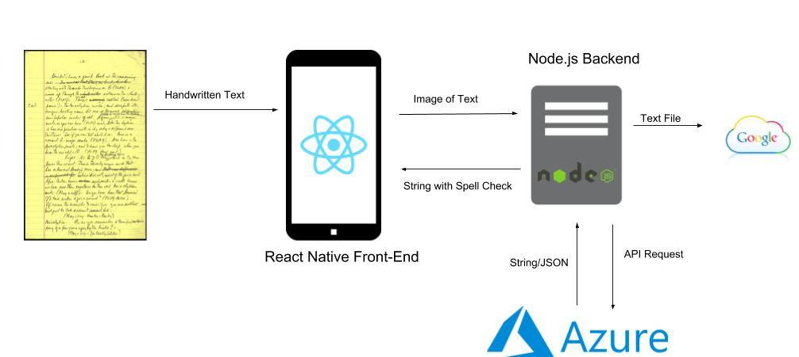

### Local Hack Day 2018

For anyone who wants to scan their hand written work onto their computers or want a quick spell check, they can use this application. Microsoft Azure has Computer Vision APIs and Spell Check APIs which allow us to translate handwritten text to a string and also spell check the string. Google Drive API allows us to automatically push our text document onto your personal account.

